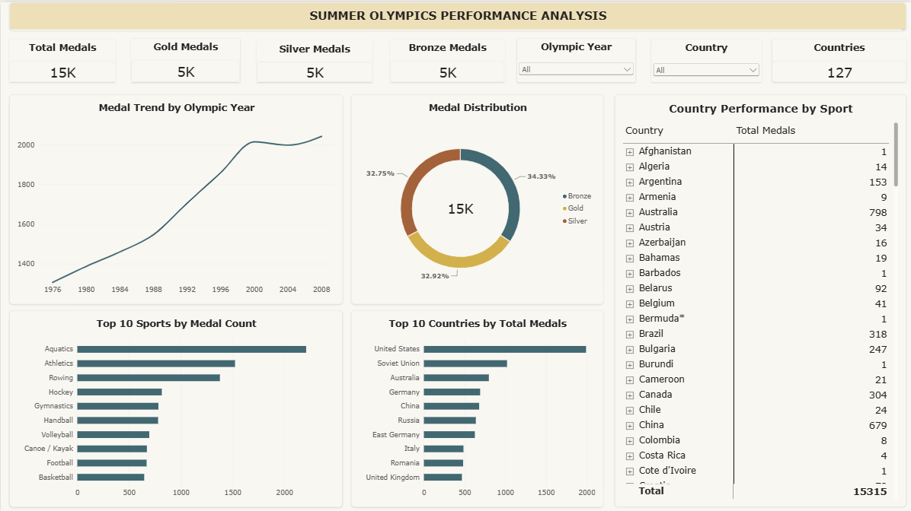

# Summer Olympics Performance Analysis

An end-to-end data analytics project analyzing Summer Olympic medal performance from **1976 to 2008** using **Python, SQL Server, and Power BI**.

The project covers data cleaning, exploratory data analysis, SQL-based analysis, and interactive dashboard development.

---

## 📌 Project Overview

This project analyzes Olympic medal data to identify trends in medal distribution, country performance, sports, and changes in performance over time.

### Tools & Technologies

- **Python**
  - Pandas
  - Matplotlib
  - Seaborn
- **SQL Server**
- **Power BI**
- **Jupyter Notebook**
- **Git / GitHub**

---

## 🧹 Data Cleaning

Data cleaning was performed in Python before loading the data into SQL Server.

The main cleaning steps included:

- Removing completely empty rows
- Removing duplicate records
- Converting the `Year` column to integer format
- Saving the cleaned dataset as a UTF-8 CSV file

After cleaning:

**15,315 records** remained.

---

## 🐍 Python Analysis

Exploratory data analysis was performed using **Pandas, Matplotlib, and Seaborn**.

The analysis covered:

- Dataset overview
- Data quality checks
- Medal distribution
- Medal trends by Olympic year
- Medal distribution by gender
- Top countries by total medals
- Top countries by gold medals
- Country performance over time
- Top sports by medal count
- Country-sport performance
- Country medal growth between early and recent periods

### Period Comparison

The analysis also compared medal performance between:

| Period | Olympic Years |
|---|---|
| Early Period | 1976–1992 |
| Recent Period | 1996–2008 |

---

## 🗄️ SQL Analysis

The cleaned dataset was imported into **SQL Server** and analyzed using multiple SQL scripts.

### SQL Analysis Includes

- Data validation
- Duplicate detection
- Medal analysis
- Country performance
- Sport analysis
- Time-series analysis
- Country rankings
- Medal growth
- Window function analysis
- SQL Views

### SQL Concepts Used

- `GROUP BY`
- `CASE`
- `SUM()`
- `COUNT()`
- `DISTINCT`
- `CTE`
- `LAG()`
- `RANK()`
- `ROUND()`
- Window Functions
- SQL Views

---

## 📊 Power BI Dashboard

The Power BI dashboard provides an interactive overview of Olympic medal performance.

### Dashboard Components

- Total Medals
- Gold Medals
- Silver Medals
- Bronze Medals
- Total Countries
- Medal Trend by Olympic Year
- Medal Distribution
- Top 10 Sports by Medal Count
- Top 10 Countries by Total Medals
- Country Performance by Sport
- Olympic Year Slicer
- Country Slicer

### Dashboard Preview



---

## 🔍 Key Insights

Some major observations from the analysis include:

- The dataset contains **15,315 medal records** after cleaning.
- The **United States** has the highest overall medal count in the dataset.
- **Aquatics** is the sport with the highest number of medal records.
- Medal counts increased substantially across the analyzed Olympic period.
- **Bronze medals** have the largest share of total medals, followed by gold and silver.
- Country performance varies considerably across different sports.
- Several countries showed substantial increases in medal counts between the early and recent periods.

---

## 📁 Project Structure

```text
summer-olympics-performance-analysis/
│
├── data/
│   ├── Summer-Olympic-medals-1976-to-2008.csv
│   └── Summer-Olympic-medals-1976-to-2008-clean.csv
│
├── notebooks/
│   └── 01_Summer_Olympics_EDA.ipynb
│
├── sql/
│   ├── 01_Data_Validation.sql
│   ├── 02_Medal_Analysis.sql
│   ├── 03_Country_Performance.sql
│   ├── 04_Sport_Analysis.sql
│   ├── 05_Time_Series_Analysis.sql
│   └── 06_Dashboard_Views.sql
│
├── dashboard/
│   └── dashboard.pbix
│
├── images/
│   └── dashboard.png
│
├── README.md
├── requirements.txt
└── .gitignore
